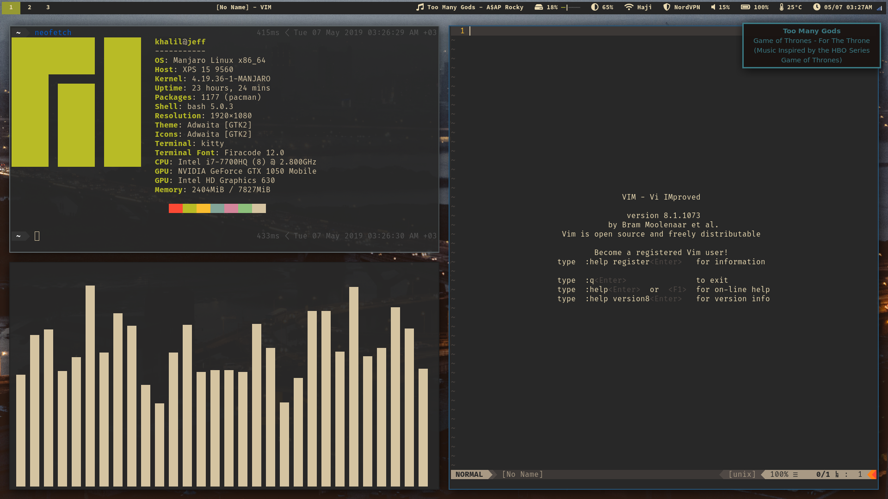
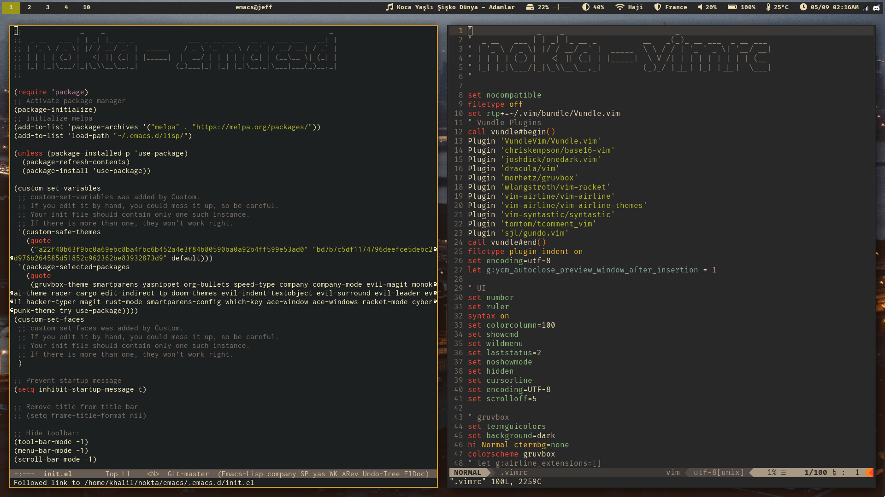

# nokta
This is a collection of my dotfiles.
Nokta means dot in Turkish.

## organization
I am currently using GNU Stow so the hierarchy of files in this repo reflect that. I may change 
this in the future to a system that doesn't require this level of nesting.

## installation
To install these files you must have stow installed. You should be able to install stow
from whichever package manager you are using or from [here](https://www.gnu.org/software/stow/). 

To symlink the configuration files into your home directory run:
```sh
git clone https://github.com/khalilhaji/nokta.git 
cd nokta
./nokta.sh
```

Alternatively, if you don't want to install all of the configuration files, you can stow each packge individually like this:

``` sh
stow -t ~ vim emacs ...
```


## theme
I tried to use the [gruvbox](https://github.com/morhetz/gruvbox) theme wherever possible. When a gruvbox theme wasn't available, I tried my best to use gruvbox colors.
I haven't had the time to make a gtk theme that looks good with gruvbox colors but that is on my todo list.

## editors
I use a combination of vim and emacs in my daily life depending on what I'm doing. I use `evil-mode` in emacs as I find myself to be more productive with vim keybindings.
I only recently switched to using Firacode as my font so I still have to set it up to work properly with Emacs.
For Java development I use IntelliJ. I have never seriously configured IntelliJ so I don't have any configuration files for it.

## vpn
My `toggle-vpn` script works with the nordvpn Linux command-line interface. I need to come up with a better way to set which server to connect to. It is currently hard-coded to France as I most frequently connect to French servers. When I need to connect to a different server, I do so manually via the command line.

## screenshots




## honorable mention
I'd like to extend a special thanks to [Kyle Sferrazza](https://kylesferrazza.com/) for [his dotfiles](https://github.com/kylesferrazza/dot) which I used for inspiration when writing mine.
